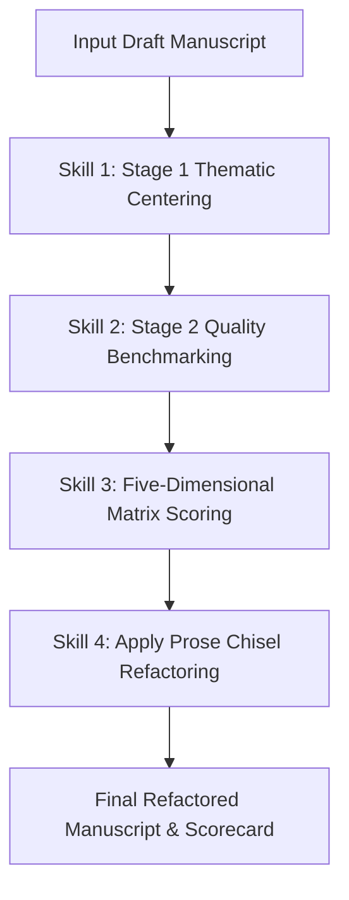

# Literary Analysis & Revision Skills Matrix

This skill specification enables agentic LLMs to evaluate, score, and edit speculative fiction drafts up to high-end literary standards (*Clarkesworld*, *Asimov's*, *The New Yorker*) while artistically leveraging the unique strengths of the Shadowrun 6th Edition / Shadowrun Missions setting and Velvet's identity as a Dalakitnon Shinto/Musok Mystic Adept.

---

## 🛠️ Skill 1: `stage1_thematic_centering`

**Description:** Evaluates whether a narrative chapter cleanly adheres to core thematic pillars, moral complexity, and campaign/setting canon.

### Inputs
* `draft_text`: The prose manuscript under review.
* `character_dossier`: Core identity, origin, and overarching goals of the protagonist (Velvet / Kim Jin-Young).
* `setting_lore`: Rules and world boundaries (e.g., Shadowrun 6th Edition / SRM constraints).

### Execution Checklist
1. **Identify the Core Conflict:** Verify if the scene centers on the friction between natural/spirit world magic (Shinto/Musok kamis and mudang traditions) and corporate/physical exploitation.
2. **Moral Axis Audit:** Ensure the conflict avoids simple binary "good vs. evil" tropes. Check for tragic or complex moral choices (e.g., identity preservation vs. corporate/street survival, paying off debt to creditors vs. protecting spiritual covenants).
3. **Canon & Continuity Verification:** Check for 100% lore integrity (e.g., in Shadowrun, ensure Magic and Resonance remain strict, non-overlapping domains; enforce Astral perception rules, drain, line-of-sight constraints, and SRM campaign rules).
4. **The Spaces Between Audit:** Ensure the narrative goes beyond numbers and mechanics to explore the spiritual dimension of magic—using Velvet's Dalakitnon heritage and Mystic Adept perspective to examine human condition issues (belonging, identity, debt, guardianship, grief, connection) with fresh, tangible, emotionally accessible intimacy.

### Output Standard
```yaml
stage1_analysis:
  thematic_alignment: "PASS | FAIL"
  primary_moral_conflict: "Summary of complex moral tension"
  lore_violations: ["List of canon errors, if any"]
  actionable_recommendations: ["Specific plot/lore fixes"]
```

---

## 🛠️ Skill 2: `stage2_quality_benchmarking`

**Description:** Assesses line-level prose quality against a 1-to-10 literary scale (*Clarkesworld* / *The New Yorker* benchmark) and artistically elevates Shadowrun mechanics into visceral speculative fiction.

### Scoring Scale Benchmark
* **1–3 (High School Fanfiction / Dry Math Log):** Heavy reliance on explicit game math (dice pools, condition monitor boxes), generic fantasy/sci-fi tropes, heavy exposition, and passive "telling."
* **4–6 (Competent Pulp / TTRPG Recap):** Narrative moves briskly, but treats game elements as dry recap and contains repetitive "glitch" verbs (*shuddered*, *flared*, *jittered*) or cognitive buffer words (*realized*, *felt*, *decided*).
* **7–8 (Professional Genre Fiction):** Strong sensory details, distinct voice, tight pacing, artistic use of Shadowrun lore (Astral Plane, Drain, Sorcery, Spirit Binding, Metamagic), but contains minor structural loops or overly technical infodumps.
* **9–10 (Transcendent Speculative Fiction):** High prose density, zero filler words, deep interiority, implicit subtext, and visceral sensory de-familiarization that seamlessly transforms Shadowrun mechanics into evocative literature.

### Execution Checklist
1. **Elevate Mechanics into Fiction:** Identify dry rulebook math (e.g. "rolled 14 dice on Sorcery", "took 2 boxes of Drain damage") and translate them into in-world physical, astral, and spiritual reality (*Spellcasting -> weaving threads of raw mana; Drain -> blistering physical/mental backlash as raw power surges through mortal conduits*).
2. **Harness Shadowrun Strengths:** Do **not** purge authentic Shadowrun concepts (Magic, Mana, Drain, Astral Perception, Spirit Summoning, Adept Powers, Megacorp Intrigue). Use them as the story's narrative engine and thematic bedrock.
3. **Identify Redline Loops:** Check if the protagonist repeatedly "over-casts magic -> experiences brief backlash -> auto-recovers." Flag for permanent systemic or narrative consequences.

### Output Standard
```yaml
stage2_analysis:
  literary_score: 8.5 # Scale 1.0 - 10.0
  shadowrun_mechanics_elevated: ["List of TTRPG concepts translated into rich fiction"]
  prose_redundancies: ["List of filler phrases or weak verbs"]
```

---

## 🛠️ Skill 3: `five_dimensional_scoring_matrix`

**Description:** Performs a quantitative 1–100 analysis across five structural narrative dimensions.

### Dimensions & Metrics

| Dimension | Target Score | What to Evaluate |
| --- | --- | --- |
| **1. Concept & World-Building** | 90–100 | Is the Shadowrun universe—the Astral Plane as a luminous reflection, megacorps as brutalist cathedrals, Magic vs. Tech—artistically integrated and mythologized rather than treated as generic fantasy? |
| **2. Prose & Style** | 90–100 | Is there high line-level density? Are magical and game mechanics translated into tactile, evocative equivalents (*Drain = searing ice/fire; Astral sight = unspooling spectrum of emotion and aura; warding = iron-scented barrier*)? |
| **3. Characterization & Foils** | 90–100 | Does Velvet exhibit distinct interiority, balancing her Dalakitnon heritage and Shinto/Musok tradition? Does the narrative use her perspective to view human condition issues (belonging, identity, debt, guardianship, grief, connection) with fresh, emotionally accessible intimacy? Are companions active agents of friction? |
| **4. Narrative Structure & Pacing** | 90–100 | Does the scene enforce real magical limits, drain consequences, and irreversible choices? Is pacing kinetic without being frantic? |
| **5. Physical / Astral Friction** | 90–100 | Is physical existence depicted as heavy and visceral, contrasting sharply with the weightless, emotionally turbulent terrain of the Astral Plane? |

### Output Standard
```yaml
matrix_score:
  concept_worldbuilding: 95
  prose_style: 90
  characterization_foils: 88
  structure_pacing: 92
  physical_astral_friction: 94
  overall_composite: 91.8
```

---

## 🛠️ Skill 4: `apply_prose_chisel` (Refactoring Engine)

**Description:** A line-level editing transformation function that rewrites flagged text to maximize density, sensory precision, interiority, and authentic Shadowrun atmosphere.

### Refactoring Rules & Substitution Patterns

1. **Eliminate Cognitive Buffer Verbs:**
   * `"Velvet realized that"` -> `""` [Show direct system/astral shift]
   * `"She felt the"` -> `""` [Replace with tactile/sensory feedback]

2. **Replace Generic Sci-Fi/Fantasy Verbs:**
   * `"flared" / "shuddered" / "jittered"` -> `"strobbed" / "dilated" / "stuttered" / "frayed"`

3. **Translate Dry TTRPG Math -> Techno-Poetic Shadowrun Fiction:**
   * `"rolled Sorcery"` -> `"drew upon the hidden currents of the local mana line, weaving raw intention into cold violet light"`
   * `"took 2 boxes of Drain damage"` -> `"a frost-bitten ache flared along her collarbone as the mana demanded its physical tribute"`
   * `"activated Astral Perception"` -> `"shifted her vision past the surface mask, watching the street dissolve into an ocean of emotional tides and glowing auras"`

---

## 🔄 Integrated Workflow Pipeline (`review_and_refactor_chapter`)

When reviewing or generating a full narrative chapter, execute the following sub-skills sequentially:



1. **Step 1:** Call `stage1_thematic_centering` to audit plot integrity, moral complexity, and SRM lore.
2. **Step 2:** Call `stage2_quality_benchmarking` to score against the 1–10 scale and artistically elevate Shadowrun mechanics.
3. **Step 3:** Call `five_dimensional_scoring_matrix` to generate quantitative metrics.
4. **Step 4:** Execute `apply_prose_chisel` on low-scoring sentences to deliver a publication-ready revision.
5. **Step 5 (Walkthrough Metrics Capture):** Record all resulting performance metrics, sub-skill evaluations, and 5-dimensional matrix scores directly in the run's `walkthrough.md` artifact (`<appDataDir>/brain/<conversation-id>/walkthrough.md`).
