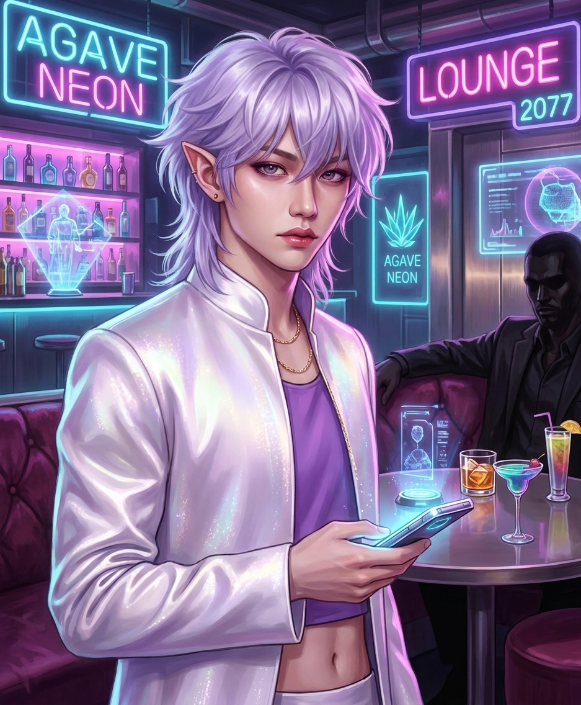

# **Character Blueprint: The Broken Chord**

## **1\. The Tragic Origin (The Commodity)**

* **The Slums of Manila:** Born a Daleketnon (Elf) to a destitute family in the Philippines, his early signs of extreme Charisma and magical potential weren't a blessing—they were a survival ticket.  
* **Sold to the Corp:** His starving parents sold him at a young age to a Mitsuhama entertainment subsidiary. He was placed into grueling, military-discipline idol trainee dorms for over a decade, stripped of his cultural identity.  
* **The Universal Face:** The corporation invested fortunes in extensive, bio-sculpting cosmetic surgeries and permanent physical alteration spells to completely erase his Filipino features, reconstructing him into an optimized, "pan-Asian" aesthetic optimized for international marketability.

## **2\. The Corporate Weapon (The Death Messengers)**

* **The Star-Powered Grim Reaper:** He debuted as the "Face" and lead vocalist of TXM (a.k.a. The Death Messengers). Under the glitz, they were an elite corporate asset team trained in intense combat magic and synchronized coordination.  
* **The Living Ritual:** The band's massive stadium concerts were actually massive, collective **Geomantic Rituals**. The synchronized choreography and the raw emotion of 80,000 screaming fans were used to channel immense astral power into the corporate grid to rewrite the free will of entire metroplexes.  

## **3\. Resistance**

* **The Variety Show Spark:** During a massive, highly televised Matrix reality challenge, he was paired with **Hana ("Luna")**, the center star of Wuxing’s girl group, **Yueying**. Off-camera, stripping away their public masks, they connected over shared experiences.  
* **The Sabotage:** He discovered that his corporate handlers planned a massive mega-ritual that would target and completely consume Hana’s group to absorb their astral power. He sabotaged a major live performance, shattered the ritual matrix, and vanished into the shadows.  

## **4\. The Shadow Present (Weaponized Perfection in Seattle)**

* **The Shadow Bodyguard:** He runs the shadows to develop an underground network and survive repossession attempts.

## **The Playstyles**

* **Weaponized Charisma & Fluid Identity:** In negotiations, he treats the smoke-filled room like a stage. He effortlessly fluid-shifts his presentation—even changing genders to perfectly target a Mr. or Mrs. Johnson’s psychological profile, completely dominating negotiations and dictating terms.  
* **The "Stage-Craft" Combat:** When combat goes loud, his movement is pure, high-speed stage choreography. He keeps distance with uncanny, rehearsed grace, preferring to cast spells or bolster allies from afar.  
* **The Mic Drop:** He favors avoiding combat when possible, and uses the minimum force necessary when unavoidable.
